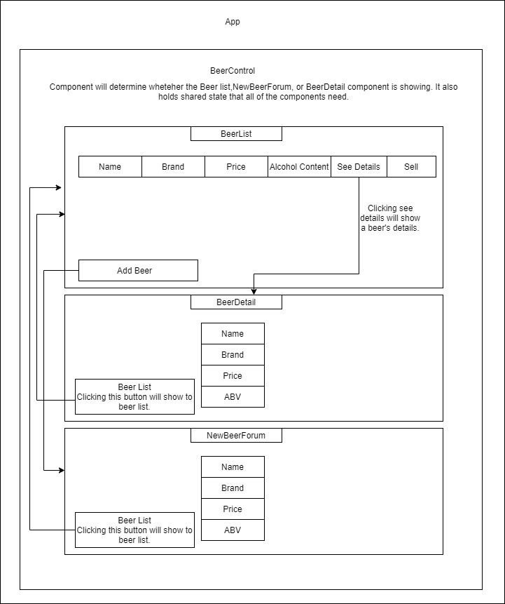
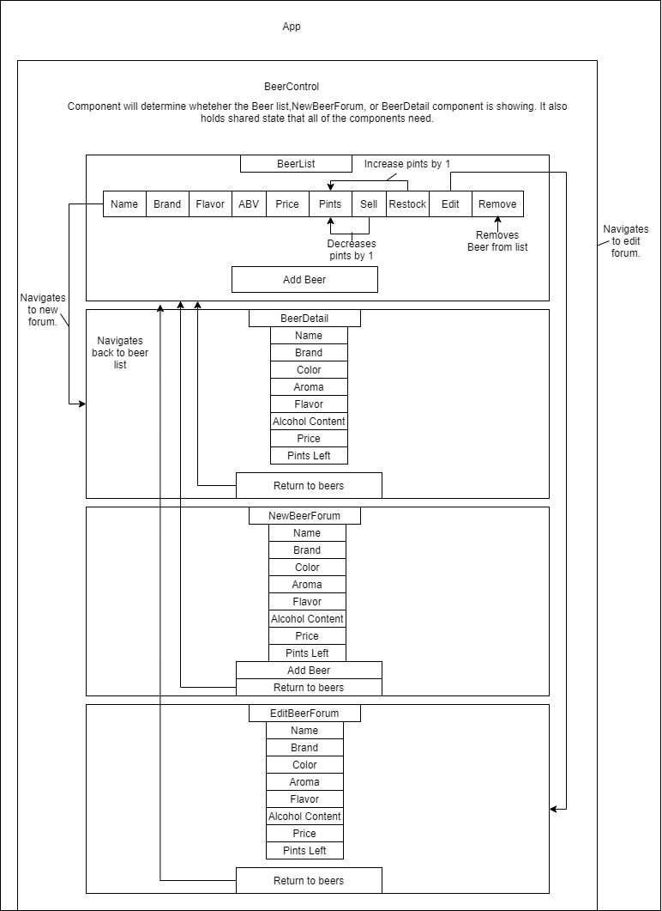

# Tap Room

#### React Independent Project Exercise for [Epicodus](https://www.epicodus.com/), 04.24.2020

#### By **Andrew Philpott**

[About](#About) | [Prompt](#Prompt) | [React Component Diagrams](#React-Component-Diagrams) | [Bugs](#Known-Bugs) | [Technologies](#Technologies-Used) | [Contact](#Support-and-Contact-Details)

## About

This is a web application to practice React fundamental concepts focusing on component diagrams, shared, and local state.

## Prompt

Independent Projects Review
Welcome to your first React independent project! Before you begin, take a moment to revisit and review the Independent Projects and Code Reviews lesson.

Tap Room
This will be a two-week project. Spend today building a tap room in React where a bar or kombucha store can track their kegs. This could also be a soda fountain, a water cooler... really anything that can be distributed and the remaining amount tracked.

Before getting started, plan out your application and draw a component tree or component diagram that shows the structure of your components. This is a requirement for the project and should be included in your README. You may draw the structure on a piece of paper and take a picture of it or use an application like https://www.draw.io/.

Here are some possible user stories to get you started. The application should have the following functionality:

- [x] As a user, I want to see a list/menu of all available kegs. For each keg, I want to see its name, brand, price and alcoholContent (or perhaps something like flavor for a kombucha store).
- [x] As a user, I want to submit a form to add a new keg to a list.
- [x]As a user, I want to be able to click on a keg to see its detail page.
- [x]As a user, I want to see how many pints are left in a keg. Hint: A full keg has roughly 124 pints.
- [x] As a user, I want to be able to click a button next to a keg whenever I sell a pint of it. - [x] This should decrease the number of pints left by 1. Pints should not be able to go below 0.
      Further Exploration
- [x]As a user, I want the option to edit a keg's properties after entering them just in case I make a mistake.
- [x] As a user, I want to be able to delete a keg.
- [x] As a user, I want a keg to update to say "Out of Stock" once it's empty.
- [x] As a user, I want kegs with less than 10 pints to include a message that says "Almost Empty" so I can try a pint before it's gone!
- [] As a user, I want to have kegs prices to be color-coded for easy readability. This could be based on their price, the style of beer or kombucha, or the amount of pints left.
- [x] As a user, I want this application to be nicely styled. (Use stylesheets and CSS objects!)
      Objectives
      This week's progress will be checked using the following objectives:

Application compiles and runs and all required functionality is included.
Functional and class components are used correctly.
Application effectively uses local and shared state.
Props are used correctly and always include PropTypes.
README includes an accurate representation of the application's component tree.
Commit history shows eight hours of work.
Project was submitted by the Friday deadline.
Project demonstrates an understanding of this week's concepts. If prompted, you can discuss your code with an instructor using the correct terminology.

## React Component Diagrams

### Start of day

### End of day

## Known Bugs

The prices text on the beer list page should either be green, yellow, or orange depending on price but currently will not.

## Technologies Used

- HTML
- CSS
- JavaScript
- Material UI
- React
- Draw.io

## Support and Contact Details

Feel free to provide feedback via email: andrewphilpott92@gmail.com

### License

This application is licensed under the MIT license.

Copyright (c) 2020 **Andrew Philpott**
